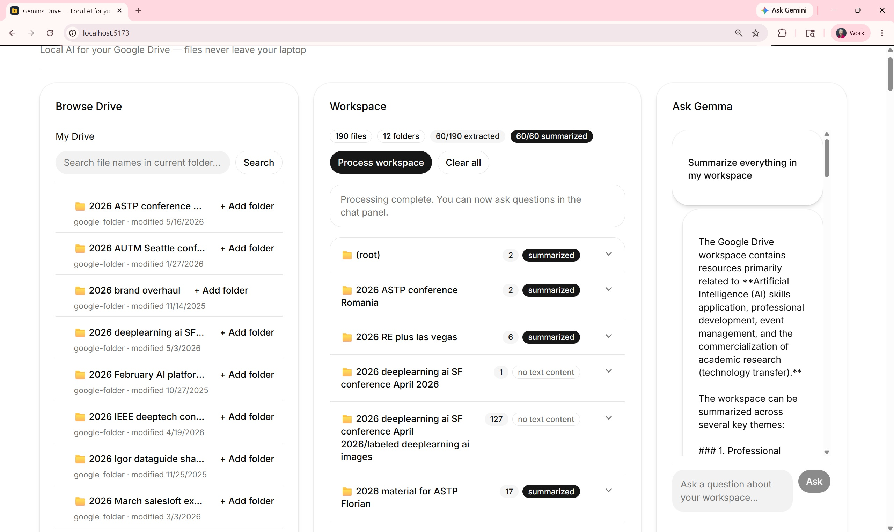

# Gemma Drive

**Local AI for your Google Drive — your files never leave your laptop.**

Connect your Google Drive, pick files and folders, and ask questions across them — all powered by [Gemma](https://ai.google.dev/gemma) running locally via [Ollama](https://ollama.com). The only thing that leaves your machine is the OAuth handshake with Google.



## Why

Cloud AI on your own documents means handing your work — research notes, contracts, internal memos, draft patents — to whoever's running the model. For sensitive material, that's a non-starter.

Gemma Drive is the alternative: the same workflow (pick docs, summarize, ask), but every byte of content stays on your hardware. Gemma is small enough to run well on a laptop, capable enough to give you useful summaries and Q&A across folders that wouldn't fit in a single context window.

## What it does

- **Connect** your Google account via OAuth (read-only Drive scope).
- **Browse** your Drive and pick individual files or whole folders into a workspace.
- **Extract** text from PDFs, Google Docs / Sheets / Slides, Word, PowerPoint, Excel, plain text, and Markdown.
- **Summarize** each file individually, then roll up per-folder summaries.
- **Ask** freeform questions across your workspace — Gemma answers using the folder and file summaries as context, which scales to workspaces that wouldn't fit directly into a model's context window.

<!-- TODO: optional 30-second demo GIF -->

## Quick start

You'll need:

- Python 3.11+
- Node.js 20+
- [Ollama](https://ollama.com/download) installed and running
- A Google Cloud project with the Drive API enabled (free — see [Getting Google OAuth credentials](#getting-google-oauth-credentials) below)

```bash
# 1. Clone
git clone https://github.com/KISSPatent/gemma-drive.git
cd gemma-drive

# 2. Pull a Gemma model
ollama pull gemma3:4b       # ~3 GB; or any Gemma variant your hardware can handle

# 3. Backend
cd backend
python -m venv .venv
source .venv/bin/activate   # Windows PowerShell: .venv\Scripts\Activate.ps1
pip install -r ../requirements.txt
cp .env.example .env        # then edit .env — see Configuration below
python manage.py migrate
python manage.py runserver 127.0.0.1:8000

# 4. Frontend (new terminal)
cd frontend
npm install
npm run dev
```

Open <http://localhost:5173>, click **Connect Google Drive**, complete OAuth, and start picking files.

## Configuration

Copy `backend/.env.example` to `backend/.env` and fill in:

| Variable | Required | What it is |
|---|---|---|
| `DJANGO_SECRET_KEY` | yes | Generate with `python -c "from django.core.management.utils import get_random_secret_key; print(get_random_secret_key())"` |
| `GOOGLE_CLIENT_ID` | yes | OAuth client ID from Google Cloud Console |
| `GOOGLE_CLIENT_SECRET` | yes | OAuth client secret |
| `GOOGLE_REDIRECT_URI` | yes | `http://localhost:8000/api/auth/google/callback` |
| `FRONTEND_URL` | yes | `http://localhost:5173` |
| `DJANGO_DEBUG` | yes | `True` for local development |
| `OLLAMA_URL` | no | Defaults to `http://localhost:11434` |
| `OLLAMA_MODEL` | no | Defaults to `gemma3:4b`; set to whatever `ollama list` shows |

### Getting Google OAuth credentials

1. Open [Google Cloud Console](https://console.cloud.google.com).
2. Create a new project (or pick an existing one).
3. Under **APIs & Services → Library**, enable the **Google Drive API**.
4. Under **APIs & Services → Credentials**, create an **OAuth 2.0 Client ID** of type *Web application*.
5. Add `http://localhost:8000/api/auth/google/callback` to authorized redirect URIs.
6. Copy the Client ID and Client Secret into your `.env`.

If your OAuth consent screen is in "Testing" mode (the default), add your own Google account as a test user — otherwise the consent screen will block you.

## Architecture

```
┌────────────────┐         ┌──────────────────┐         ┌─────────────────┐
│  React (5173)  │ ──────▶ │  Django (8000)   │ ──────▶ │  Google Drive   │
│  shadcn/ui     │         │  DRF + SQLite    │         │  (OAuth)        │
└────────────────┘         └────────┬─────────┘         └─────────────────┘
                                    │
                                    ▼
                           ┌──────────────────┐
                           │  Ollama (11434)  │
                           │  Gemma           │
                           └──────────────────┘
```

The backend handles OAuth, fetches and extracts file text from Drive, persists summaries in SQLite, and proxies questions to Ollama. The frontend is a thin shadcn/ui workspace. No document content ever leaves your machine — only the OAuth handshake and Drive metadata calls go to Google.

## Tech stack

- **Frontend:** React 19, TypeScript, Vite, Tailwind v4, shadcn/ui, Radix primitives, Lucide icons.
- **Backend:** Django 6, Django REST Framework, django-cors-headers, SQLite.
- **Extraction:** pdfplumber, python-docx, python-pptx, openpyxl.
- **Google integration:** google-api-python-client with OAuth 2.0 + PKCE.
- **AI:** Gemma via Ollama.

## Running the tests

```bash
cd backend
python manage.py test chat
```

The extraction tests mock the Drive service so they run offline.

## Scope & limitations

Gemma Drive is designed as a **single-user, local-only** tool. It runs on your laptop, talks to your Drive on your behalf, and sends document text to a model running on your machine via Ollama. Some intentional trade-offs follow from that:

- **No authentication on the backend.** The app assumes the only client reaching `localhost:8000` is your own browser. Run Django on `127.0.0.1` only — never `0.0.0.0` — and don't expose the port to your network.
- **One connected Google account at a time.** Connecting a second account overwrites the first. Multi-user support is out of scope.
- **OAuth tokens are stored unencrypted** in the local SQLite database. File permissions are the only protection. This matches the threat model (your laptop) but is not suitable for shared machines.
- **CSRF is disabled on `/api/drive/picked`** for simplicity; CORS is locked to `localhost:5173`, which bounds the risk to local origins.
- **Drive search escaping handles single quotes only.** Fine for typing your own queries; not hardened against adversarial input.
- **The Google Picker integration was attempted and abandoned.** See `frontend/src/hooks/useGooglePicker.ts` for the unused code — the current file-selection flow uses direct Drive API browsing instead.

## License

MIT — see [LICENSE](LICENSE).
